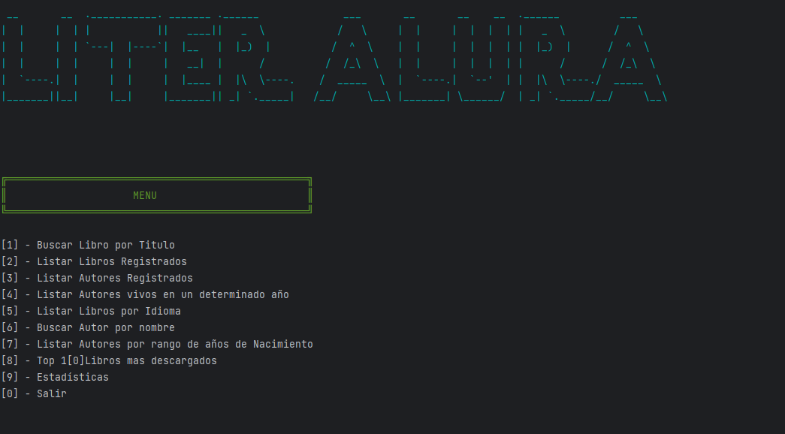
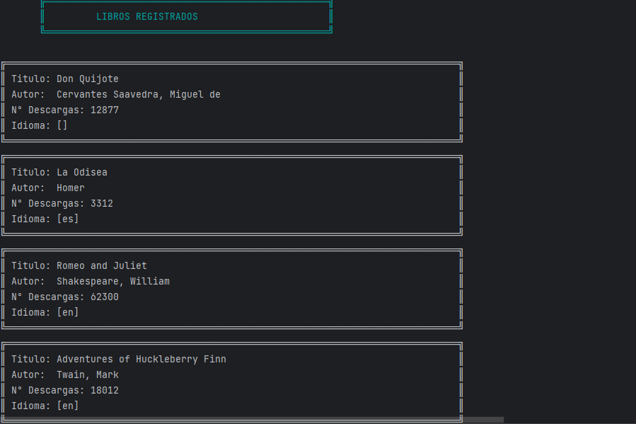
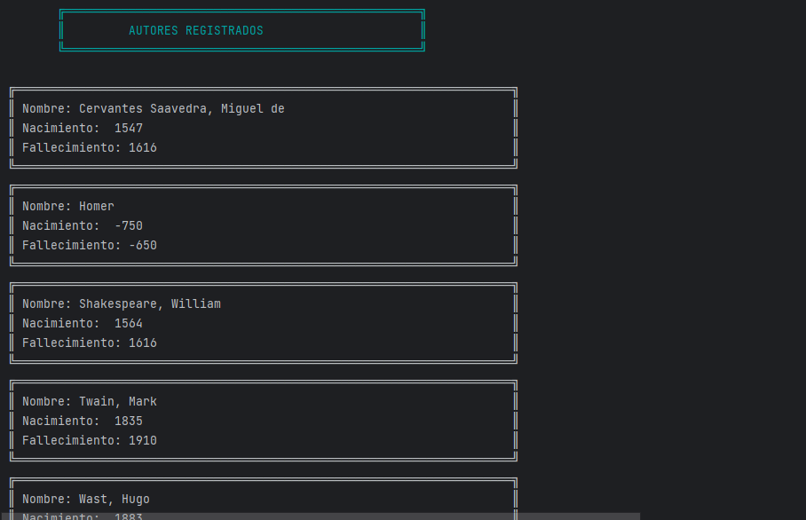

# 📚 LiterAlura - Catálogo de Libros

### Menu Principal

### Libros Registrados

### Autores Registrados

## 🌟 Descripción del Proyecto

LiterAlura es una aplicación de catálogo de libros desarrollada como parte del curso de Java Full Stack de Alura Latam. Esta aplicación de consola permite a los usuarios explorar, buscar y gestionar una colección de libros utilizando datos de la API Gutendex.

## 🛠 Tecnologías Utilizadas

- **Lenguaje**: Java 17
- **Framework**: Spring Boot
- **Base de Datos**: PostgreSQL
- **API**: Gutendex
- **Bibliotecas Principales**: 
  - Jackson Databind
  - Dotenv
  - Spring Data JPA

## ✨ Funcionalidades Principales

### Gestión de Libros
- Buscar libros por título
- Listar libros registrados
- Filtrar libros por idioma
- Ver estadísticas de descargas de libros

### Gestión de Autores
- Listar autores registrados
- Buscar autores por nombre
- Filtrar autores vivos en un año determinado
- Listar autores por rango de años de nacimiento

## 🚀 Arquitectura del Proyecto

La aplicación sigue una arquitectura modular y limpia:
- **Capa DTO**: Objetos de Transferencia de Datos
- **Capa de Modelos**: Entidades principales (Autor, Libro)
- **Capa de Repositorios**: Interacciones con la base de datos
- **Capa de Servicios**: Consumo de API y procesamiento de datos

## 🔧 Instalación y Configuración

### Requisitos Previos
- Java 17
- PostgreSQL
- Maven o Gradle

### Pasos
1. Clonar el repositorio
   ```bash
   git clone https://github.com/tu-usuario/literalura.git
   cd literalura
   ```

2. Configurar variables de entorno
   Crea un archivo `.env` con:
   ```
   DB_URL=jdbc:postgresql://localhost:5432/literalura
   DB_USER=tu_usuario
   DB_PASSWORD=tu_contraseña
   ```

3. Instalar dependencias y ejecutar
   ```bash
   # Usando Maven
   mvn clean install
   mvn spring-boot:run
   ```

## 🌐 Integración de API

La aplicación utiliza la [API Gutendex](https://gutendex.com/) para obtener datos de libros y autores, procesando respuestas JSON y almacenándolas en una base de datos PostgreSQL.

## 🤝 Contribuciones

¡Las contribuciones son bienvenidas! Sigue estos pasos:
1. Haz un fork del repositorio
2. Crea tu rama de características (`git checkout -b caracteristica/Mejora`)
3. Confirma tus cambios (`git commit -m 'Agregar nueva característica'`)
4. Sube tu rama (`git push origin caracteristica/Mejora`)
5. Abre un Pull Request

## 🏆 Créditos

Desarrollado como parte del Desafío de Java Full Stack de Alura Latam.

## Autor
- Jonatan Atencio 

## 📧 Contacto

aa.jonatan@gmail.com